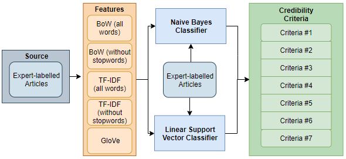
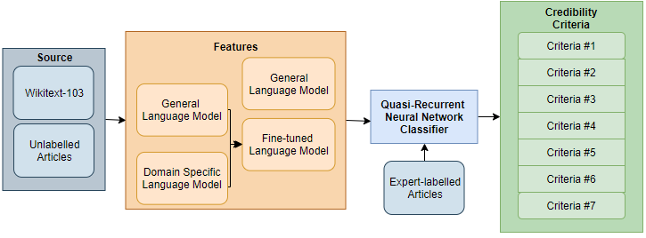
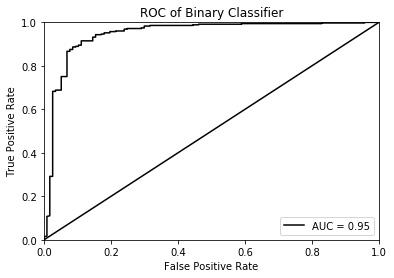

# Honours-Thesis
Repository for my honours thesis project: "Detecting health misinformation in web page text using deep learning methods"

This repository contains the code used to create the ML models and LM used by the QRNN model.

## Project Description
Misinformation is not a new phenomenon but the popularity and ubiquity of social media has meant that the rate at which information is produced and spreads greatly outpaces our ability to evaluate whether it is correct and unbiased. Thisis especially important in health and healthcare as it can lead to harm in the form of mistreatment and mismanagement of a range of health conditions; vaccination decision making is a common example.

In this project, I developed a novel approach to predicting the credibility of information in vaccine-related news articles by evaluating the effectiveness and feasibility of machine learning techniques (Naive Bayes and Support Vector Machines) and a deep learning technique ([Quasi Recurrent Neural Network](https://github.com/salesforce/pytorch-qrnn/)) on the classification of credibility criteria. The NB, SVM and QRNN classifiers were all trained and evaluated on an expertly labelled dataset of 470 vaccine-related articles.

### Machine Learning Models

### Deep Learning Models

## Results

The models were evaluated on two classification tasks, the first task being determining whether a given article satisfies a specific criteria related to credibility and the second task aims to determine whether a given article is either low or high credidibility.

### Credibility Satisfaction Task - ML Models (Micro-averaged F1 Score)

### Credibility Satisfaction Task - DL Models (Micro-averaged F1 Score)

### Identification of Low Credibility Sources (SVM Classifier with TF-IDF scores of article words without stopwords)

